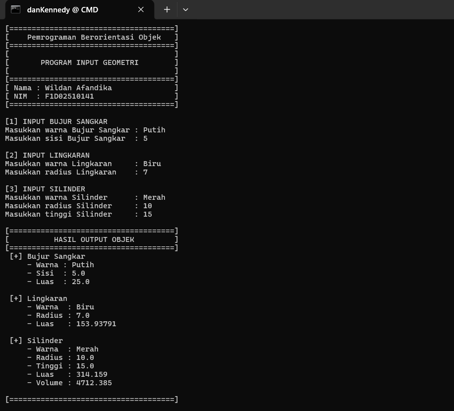

<div align="center">
  
  <br>
  <marquee scrollamount="10" direction="left" behavior="alternate">🚀 <b>PEMROGRAMAN BERORIENTASI OBJEK 2026</b> 🚀</marquee>
  
  <p>
    
    
    
  </p>
  
  
</div>

# Tugas Pemrograman Berorientasi Objek (PBO)

**Nama** : Wildan Afandika  
**NIM**    : F1D02510141  

---

Repositori ini berisi implementasi tugas pemrograman berorientasi objek dalam bahasa Java yang mencakup penerapan konsep *Enkapsulasi*, *Pewarisan (Inheritance)*, dan *Polimorfisme*. Program ini memodelkan perhitungan geometri dasar untuk bangun datar dan bangun ruang.

## 📌 Struktur Kelas & Penerapan OOP

### 1. Encapsulation (Enkapsulasi)
Enkapsulasi diterapkan dengan menggunakan access modifier `private` pada variabel atribut di setiap kelas, sehingga data terlindungi dari akses langsung luar kelas. Akses dan modifikasi nilai dilakukan melalui method `getter` dan `setter`.

Contoh pada kelas `Bentuk`:
```java
public class Bentuk {
    private String warna;
    
    public Bentuk(String warna) {
        this.warna = warna;
    }
    
    public String getWarna() {
        return warna;
    }
    
    public void setWarna(String warna) {
        this.warna = warna;
    }
}
```

### 2. Inheritance (Pewarisan)
Pewarisan menggunakan keyword `extends` untuk mewarisi atribut dan method dari *parent class* ke *child class*:
- `BujurSangkar` mewarisi `Bentuk`
- `Lingkaran` mewarisi `Bentuk`
- `Silinder` mewarisi `Lingkaran` (multilevel inheritance)

Contoh pada kelas `Silinder` yang memanggil *constructor* dari *parent class*-nya (`Lingkaran`):
```java
public class Silinder extends Lingkaran {
    private double tinggi;
    
    public Silinder(double tinggi, double radius, String warna) {
        super(radius, warna); // Memanggil constructor parent
        this.tinggi = tinggi;
    }
}
```

### 3. Polymorphism (Polimorfisme)
Polimorfisme diterapkan melalui *method overriding*, di mana *child class* menimpa/menyediakan implementasi spesifik dari method `printInfo()` yang dideklarasikan di *parent class*.

Contoh pada kelas `BujurSangkar`:
```java
@Override
public void printInfo() {
    System.out.println(" [+] Bujur Sangkar");
    System.out.println("     - Warna : " + getWarna());
    System.out.println("     - Sisi  : " + sisi);
    System.out.println("     - Luas  : " + hitungLuas());
    System.out.println();
}
```

---

## 🚀 Cara Menjalankan Program

1. Buka terminal/Command Prompt di direktori utama *project* ini.
2. Kompilasi semua file *source code* Java menggunakan `javac` (hasil *compile* akan masuk ke folder `bin`):
   ```bash
   javac -d bin src/*.java
   ```
3. Jalankan program utamanya (`Main.class`):
   ```bash
   java -cp bin Main
   ```

---

## 🖼️ Screenshot Hasil Eksekusi Program



